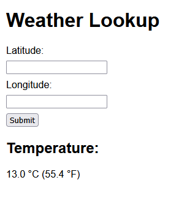

# Redis Weather Service API

A simple Go web application that fetches the current temperature for a given latitude and longitude using the National Weather Service API and caches results in Redis.

## Prerequisites

- [Go](https://golang.org/dl/) 1.21+
- [Docker](https://www.docker.com/) (for running Redis)
- Internet access (to call the NWS API)

## Setup Instructions

1. Run: `docker run --name redis-container -p 6379:6379 -d redis`
2. Run: `go run main.go`
3. Open `http://localhost:8080` in a web browser
4. Enter in a lattitude and longitude

## Results

